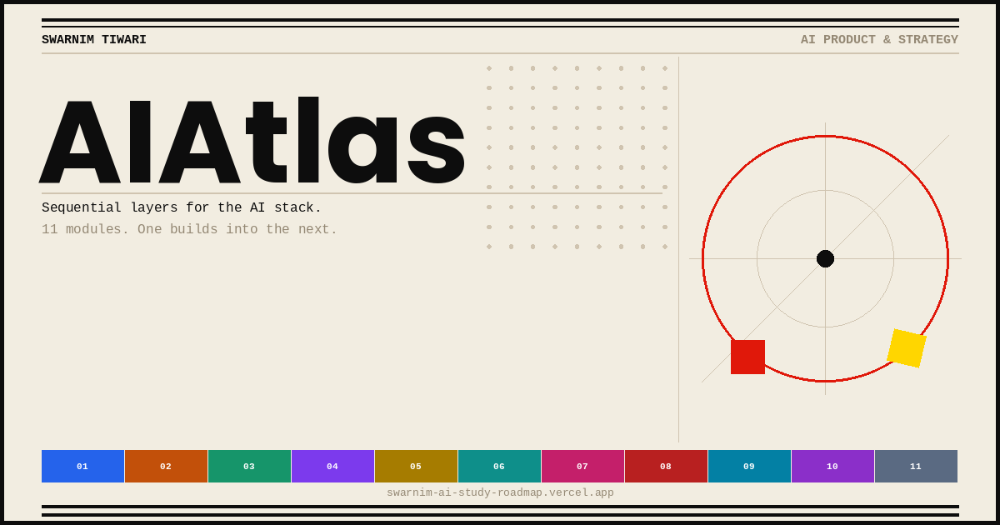

 
 

 

**Sequential layers for the AI stack.**  
11 modules. One builds into the next.  
Resources, concepts, and a litmus test for each layer. All linked.

 

---

## Why this order

Most people study AI randomly. They hit a transformers tutorial, watch a YouTube video about agents, read a thread about GPU pricing, and never connect any of it.

This framework is built on one idea: **each layer depends on the one above it.** You can't reason about agent reliability without understanding inference cost. You can't price an AI product without knowing what it costs to run. Depth where it compounds. Literacy everywhere else, by choice.

---

## The Stack

<table>
<tr>
  <td width="6px" style="background:#2563EB;padding:0"></td>
  <td width="36px"><b>01</b></td>
  <td width="120px"><code>Foundation</code></td>
  <td><b>Transformers & LLM Fundamentals</b></td>
  <td align="right"><code>3–4 wks</code></td>
</tr>
<tr>
  <td width="6px" style="background:#C2500A;padding:0"></td>
  <td><b>02</b></td>
  <td><code>Computing</code></td>
  <td><b>GPU / Computing Economics</b></td>
  <td align="right"><code>1–2 wks</code></td>
</tr>
<tr>
  <td width="6px" style="background:#16956A;padding:0"></td>
  <td><b>03</b></td>
  <td><code>Systems</code></td>
  <td><b>AI Infrastructure</b></td>
  <td align="right"><code>2–3 wks</code></td>
</tr>
<tr>
  <td width="6px" style="background:#7C3AED;padding:0"></td>
  <td><b>04</b></td>
  <td><code>Frontier</code></td>
  <td><b>Agent Systems</b></td>
  <td align="right"><code>2–3 wks</code></td>
</tr>
<tr>
  <td width="6px" style="background:#A67C00;padding:0"></td>
  <td><b>05</b></td>
  <td><code>Rigor</code></td>
  <td><b>Model Evaluation</b></td>
  <td align="right"><code>1–2 wks</code></td>
</tr>
<tr>
  <td width="6px" style="background:#0E8F8A;padding:0"></td>
  <td><b>06</b></td>
  <td><code>Ecosystem</code></td>
  <td><b>Open-Source Ecosystem</b></td>
  <td align="right"><code>1–2 wks</code></td>
</tr>
<tr>
  <td width="6px" style="background:#C41F6A;padding:0"></td>
  <td><b>07</b></td>
  <td><code>Economics</code></td>
  <td><b>AI Business Models</b></td>
  <td align="right"><code>1–2 wks</code></td>
</tr>
<tr>
  <td width="6px" style="background:#B82020;padding:0"></td>
  <td><b>08</b></td>
  <td><code>Strategy</code></td>
  <td><b>AI Strategy & Organizational Adoption</b></td>
  <td align="right"><code>1–2 wks</code></td>
</tr>
<tr>
  <td width="6px" style="background:#0380A4;padding:0"></td>
  <td><b>09</b></td>
  <td><code>Design</code></td>
  <td><b>Human-Computer Interaction</b></td>
  <td align="right"><code>1–2 wks</code></td>
</tr>
<tr>
  <td width="6px" style="background:#8B2FC9;padding:0"></td>
  <td><b>10</b></td>
  <td><code>Embodiment</code></td>
  <td><b>Robotics + Multimodal AI</b></td>
  <td align="right"><code>2–3 wks</code></td>
</tr>
<tr>
  <td width="6px" style="background:#5A6A82;padding:0"></td>
  <td><b>11</b></td>
  <td><code>Context</code></td>
  <td><b>AI Geopolitics & Governance</b></td>
  <td align="right"><code>1 wk</code></td>
</tr>
</table>

---

## Module Breakdown

<b>01 — Transformers & LLM Fundamentals</b> &nbsp;|&nbsp; Foundation

 

> If you can't explain attention without hand-waving, every opinion you have about AI is borrowed, not earned.

**Core Concepts**
- Self-attention mechanism (Q, K, V matrices)
- Multi-head attention and why multiple heads matter
- Positional encoding: sinusoidal, learned, RoPE
- Tokenization: BPE, WordPiece, SentencePiece
- Decoder-only vs encoder-decoder vs encoder-only
- Pretraining objectives: next-token prediction, masked LM
- Alignment: RLHF, PPO, DPO, Constitutional AI
- Scaling laws: Kaplan 2020, Chinchilla 2022
- KV cache mechanics and context window limits
- Hallucination causes, not just symptoms

**Resources**

| Type | Resource |
|------|----------|
| Paper | [Attention Is All You Need (Vaswani et al., 2017)](https://arxiv.org/abs/1706.03762) |
| Blog | [The Illustrated Transformer (Jay Alammar)](https://jalammar.github.io/illustrated-transformer/) |
| Code | [nanoGPT (Andrej Karpathy)](https://github.com/karpathy/nanoGPT) |
| Video | [Zero to Hero Full Playlist (Karpathy)](https://www.youtube.com/playlist?list=PLAqhIrjkxbuWI23v9cThsA9GvCAUhRvKZ) |
| Paper | [Scaling Laws for Neural Language Models (Kaplan et al., 2020)](https://arxiv.org/abs/2001.08361) |
| Paper | [Chinchilla / Training Compute-Optimal LLMs (2022)](https://arxiv.org/abs/2203.15556) |
| Paper | [InstructGPT / RLHF (Ouyang et al., 2022)](https://arxiv.org/abs/2203.02155) |
| Paper | [Direct Preference Optimization / DPO (2023)](https://arxiv.org/abs/2305.18290) |
| Book | [Build a Large Language Model From Scratch (Raschka)](https://github.com/rasbt/LLMs-from-scratch) |
| Book | [Hands-On Large Language Models (Alammar & Grootendorst)](https://www.oreilly.com/library/view/hands-on-large-language/9781098150952/) |
| Course | [Hugging Face NLP Course](https://huggingface.co/learn/nlp-course) |
| Course | [Stanford CS224N: NLP with Deep Learning](https://web.stanford.edu/class/cs224n/) |
| Course | [How Transformer LLMs Work (DeepLearning.AI)](https://www.deeplearning.ai/short-courses/how-transformer-llms-work/) |

**Litmus Test**
> *Could you derive why decoder-only architectures won, on a whiteboard, without notes?*

---

<b>02 — GPU / Computing Economics</b> &nbsp;|&nbsp; Computing

 

> Every model release, every capability claim traces back to a compute budget. FLOPs and dollars before business intuition.

**Core Concepts**
- FLOPs and what they actually measure
- Memory bandwidth as the real bottleneck, not raw compute
- Model FLOP Utilization (MFU) in practice
- H100 vs A100 vs TPU v5 architecture differences
- Tensor, pipeline, and data parallelism tradeoffs
- Training cost estimation from parameter count
- Inference cost structure: a different problem than training
- CapEx vs OpEx and the rent-vs-own calculus
- Price-performance trends across hardware generations
- Power, cooling, and the energy constraint on frontier models

**Resources**

| Type | Resource |
|------|----------|
| Blog | [Which GPU for Deep Learning? (Tim Dettmers)](https://timdettmers.com/2023/01/30/which-gpu-for-deep-learning/) |
| Blog | [Making Deep Learning Go Brrrr (Horace He)](https://horace.io/brrr_intro.html) |
| Data | [Notable AI Models: Training Compute Tracker (Epoch AI)](https://epochai.org/data/notable-ai-models) |
| Research | [AI Hardware and Compute Trends (Epoch AI)](https://epochai.org/trends) |
| Research | [SemiAnalysis: GPU Economics and AI Infrastructure](https://www.semianalysis.com/) |

**Litmus Test**
> *Given a parameter count, can you ballpark training cost within 2x and explain why inference, not training, is what actually breaks margins at scale?*

---

<b>03 — AI Infrastructure</b> &nbsp;|&nbsp; Systems

 

> Training a model is a project. Running it in production is a system. These require different skills and produce different failures.

**Core Concepts**
- Distributed training: data, tensor, pipeline parallelism
- FSDP (Fully Sharded Data Parallel) and ZeRO stages
- Megatron-LM and hybrid parallelism at scale
- Inference serving: vLLM, TensorRT-LLM, continuous batching
- PagedAttention and why it changed serving economics
- Quantization: INT8, GPTQ, AWQ, bitsandbytes
- Speculative decoding
- RAG architecture and vector database integration
- Kubernetes, GPU Operator, and cluster orchestration
- RDMA and InfiniBand networking for multi-node training

**Resources**

| Type | Resource |
|------|----------|
| Paper | [Efficient Memory Management / PagedAttention (vLLM, 2023)](https://arxiv.org/abs/2309.06180) |
| Paper | [LLM.int8(): 8-bit Matrix Multiplication (Dettmers et al., 2022)](https://arxiv.org/abs/2208.07339) |
| Docs | [PyTorch FSDP Official Documentation](https://pytorch.org/docs/stable/fsdp.html) |
| Code | [DeepSpeed (Microsoft)](https://github.com/microsoft/DeepSpeed) |
| Code | [Megatron-LM (NVIDIA)](https://github.com/NVIDIA/Megatron-LM) |
| Code | [vLLM: High-Throughput LLM Serving](https://github.com/vllm-project/vllm) |
| Book | [Designing Machine Learning Systems (Chip Huyen)](https://www.oreilly.com/library/view/designing-machine-learning/9781098107956/) |
| Docs | [NVIDIA GPU Operator Documentation](https://docs.nvidia.com/datacenter/cloud-native/gpu-operator/) |

**Litmus Test**
> *Could you design a serving stack for a 70B model that holds a real latency SLA under load?*

---

<b>04 — Agent Systems</b> &nbsp;|&nbsp; Frontier

 

> Single-turn Q&A is largely solved. The hard problem is sequential decisions with tool access, real consequences, and compounding context.

**Core Concepts**
- ReAct: reasoning and acting in a loop
- Chain-of-Thought and Tree-of-Thought prompting
- Tool use and function calling
- Memory: episodic, semantic, working, procedural
- Multi-agent architectures: supervisor and specialist patterns
- LangGraph state machines for agent control flow
- Human-in-the-loop design
- Guardrails and error recovery strategies
- Failure taxonomy: loops, drift, silent wrong answers
- Evaluation frameworks built for agentic behavior

**Resources**

| Type | Resource |
|------|----------|
| Paper | [ReAct: Synergizing Reasoning and Acting in LLMs (2022)](https://arxiv.org/abs/2210.03629) |
| Paper | [Tree of Thoughts (Yao et al., 2023)](https://arxiv.org/abs/2305.10601) |
| Blog | [LLM Powered Autonomous Agents (Lilian Weng)](https://lilianweng.github.io/posts/2023-06-23-agent/) |
| Docs | [LangGraph Official Documentation](https://langchain-ai.github.io/langgraph/) |
| Docs | [CrewAI Official Documentation](https://docs.crewai.com/) |
| Code | [MetaGPT: Multi-Agent Framework](https://github.com/geekan/MetaGPT) |
| Docs | [Anthropic Model Spec: Agentic Behavior and Safety](https://www.anthropic.com/model-spec) |

**Litmus Test**
> *In a 10-step agent pipeline, where would you bet the first failure happens, and how would you catch it before a user does?*

---

<b>05 — Model Evaluation</b> &nbsp;|&nbsp; Rigor

 

> Vibes are not a measurement system. Trustworthy evaluation is domain-specific, contamination-resistant, and tied to metrics that hold up under pressure.

**Core Concepts**
- Benchmark design and Goodhart's Law in AI
- MMLU, GPQA, HumanEval, LiveCodeBench
- HELM: holistic, multi-metric evaluation framework
- LLM-as-judge methodology and its failure modes
- Human preference evaluation: ELO and Arena-style
- Training data contamination and leakage detection
- Domain-specific eval harness construction
- Safety evaluation and red-teaming methods
- Hallucination measurement techniques
- Robustness and distribution shift testing

**Resources**

| Type | Resource |
|------|----------|
| Paper | [HELM: Holistic Evaluation of Language Models (2022)](https://arxiv.org/abs/2211.09110) |
| Paper | [Red Teaming Language Models (Anthropic, 2022)](https://arxiv.org/abs/2209.07858) |
| Tool | [Chatbot Arena / LMSYS: Human Preference Leaderboard](https://lmarena.ai/) |
| Tool | [HuggingFace Open LLM Leaderboard](https://huggingface.co/spaces/open-llm-leaderboard/open_llm_leaderboard) |
| Code | [DeepEval: LLM Evaluation Framework](https://github.com/confident-ai/deepeval) |
| Code | [RAGAS: RAG Evaluation](https://github.com/explodinggradients/ragas) |
| Code | [OpenAI Evals](https://github.com/openai/evals) |
| Blog | [Your AI Product Needs Evals (Hamel Husain)](https://hamel.dev/blog/posts/evals/) |

**Litmus Test**
> *How would you design an eval suite for an agent, knowing standard benchmarks will tell you what you want to hear?*

---

<b>06 — Open-Source Ecosystem</b> &nbsp;|&nbsp; Ecosystem

 

> The frontier does not live only inside labs. Recent open models match closed ones from 18 months ago.

**Core Concepts**
- Major open model lineages: Llama, Mistral, Qwen, DeepSeek, Falcon
- GGUF and GGML quantization formats for local inference
- LoRA (Low-Rank Adaptation) mechanics
- QLoRA: quantization combined with LoRA
- DoRA variant and when it outperforms LoRA
- HuggingFace Hub structure: models, datasets, Spaces
- PEFT and TRL library training loops
- Licensing realities: Apache 2.0, Llama community license, CC-BY
- Power-law dynamics in model downloads and usage

**Resources**

| Type | Resource |
|------|----------|
| Paper | [LoRA: Low-Rank Adaptation of Large Language Models (2021)](https://arxiv.org/abs/2106.09685) |
| Paper | [QLoRA: Efficient Finetuning (Dettmers et al., 2023)](https://arxiv.org/abs/2305.14314) |
| Code | [HuggingFace PEFT](https://github.com/huggingface/peft) |
| Code | [HuggingFace TRL: Transformer Reinforcement Learning](https://github.com/huggingface/trl) |
| Tool | [HuggingFace Hub: Model Repository](https://huggingface.co/models) |
| Course | [HuggingFace NLP Course](https://huggingface.co/learn/nlp-course) |
| Tool | [Open LLM Leaderboard (HuggingFace)](https://huggingface.co/spaces/open-llm-leaderboard/open_llm_leaderboard) |

**Litmus Test**
> *Given a fine-tuning task and a real budget, what is your stack, and when does calling an API actually make more sense?*

---

<b>07 — AI Business Models</b> &nbsp;|&nbsp; Economics

 

> Inference margins are thin and compress as models commoditize. Most "AI businesses" are distribution plays.

**Core Concepts**
- Token economics and inference margin structure
- Why API gross margins compress at scale
- Vertical AI vs horizontal AI platform strategy
- Data moats, network effects, and workflow lock-in
- Build vs buy vs fine-tune from the vendor perspective
- Open vs closed source as a strategic business choice
- AI-native SaaS vs AI features bolted onto legacy SaaS
- The wrapper trap and viable paths out of it
- Enterprise AI sales motion and procurement cycles

**Resources**

| Type | Resource |
|------|----------|
| Essay | [Generative AI Act Two (Sequoia Capital)](https://www.sequoiacap.com/article/generative-ai-act-two/) |
| Essay | [Who Owns the Generative AI Platform? (a16z)](https://a16z.com/who-owns-the-generative-ai-platform/) |
| Blog | [Benedict Evans: AI Business Analysis](https://www.ben-evans.com/) |
| Research | [Stanford AI Index: Annual Report](https://aiindex.stanford.edu/report/) |

**Litmus Test**
> *Why is sub-60% gross margin a red flag for a pure LLM API wrapper, and what structural change would fix it?*

---

<b>08 — AI Strategy & Organizational Adoption</b> &nbsp;|&nbsp; Strategy

 

> Most enterprise AI projects work technically. They fail organizationally. The pilot-to-production gap is a people and process problem, not a model problem.

**Core Concepts**
- AI maturity models and organizational readiness assessment
- Build vs buy vs partner from the buyer's perspective
- The pilot-to-production gap and why POCs stall
- Change management for AI-disrupted workflows
- Aligning IT, legal, compliance, and leadership on one rollout
- AI governance structures inside organizations
- Measuring and communicating ROI on AI investments
- The last-mile problem: user adoption and behavioral change
- Risk frameworks for enterprise AI deployment

**Resources**

| Type | Resource |
|------|----------|
| Research | [McKinsey State of AI: Annual Survey](https://www.mckinsey.com/capabilities/quantumblack/our-insights/the-state-of-ai) |
| Research | [BCG: AI Adoption and Maturity](https://www.bcg.com/capabilities/artificial-intelligence) |
| Blog | [Harvard Business Review: AI Strategy](https://hbr.org/topic/subject/ai-and-machine-learning) |

**Litmus Test**
> *Could you tell a CFO, in their language, why an 80%-accurate model might still be a bad investment?*

---

<b>09 — Human-Computer Interaction</b> &nbsp;|&nbsp; Design

 

> Streaming output, probabilistic responses, and variable latency break every interaction pattern designed for deterministic software.

**Core Concepts**
- Trust calibration: when confidence should and should not show
- Latency perception and progressive disclosure
- Prompt UX as product design, not just engineering
- Agentic UI: when to interrupt vs proceed autonomously
- Designing for graceful failure and uncertainty
- Cognitive load in AI-augmented workflows
- Streaming output and how it rewrites UX conventions
- Explainability UX: what users actually need to know

**Resources**

| Type | Resource |
|------|----------|
| Guide | [Google PAIR Guidebook: People and AI Research](https://pair.withgoogle.com/guidebook/) |
| Research | [Nielsen Norman Group: AI UX Research](https://www.nngroup.com/topic/artificial-intelligence/) |
| Blog | [Maggie Appleton: AI Interface Patterns](https://maggieappleton.com/) |
| Blog | [Amelia Wattenberger: Interface Design and AI](https://wattenberger.com/) |
| Book | [Human-Centered AI (Ben Shneiderman)](https://www.hup.harvard.edu/books/9780262544177) |

**Litmus Test**
> *How would you design an agent that asks for clarification at exactly the right moments, not too often, not too rarely?*

---

<b>10 — Robotics + Multimodal AI</b> &nbsp;|&nbsp; Embodiment

 

> Text is a compressed channel. Physical manipulation, visual reasoning, and spatial understanding are harder problems with more impact.

**Core Concepts**
- Vision Transformers (ViT) and CLIP architecture
- Vision-language-action (VLA) models for robotics
- Sim-to-real transfer and why it is harder than it looks
- The data bottleneck: why robotics lags language AI
- Open X-Embodiment and cross-robot transfer
- Hierarchical planning in embodied agents
- Multimodal fusion strategies across modalities
- World models as the path from perception to planning

**Resources**

| Type | Resource |
|------|----------|
| Paper | [CLIP: Learning Transferable Visual Models (Radford et al., 2021)](https://arxiv.org/abs/2103.00020) |
| Paper | [RT-2: Robotics Transformer 2 (Brohan et al., 2023)](https://arxiv.org/abs/2307.15818) |
| Paper | [PaLM-E: An Embodied Multimodal Language Model (2023)](https://arxiv.org/abs/2303.03378) |
| Paper | [Open X-Embodiment: Cross-Robot Transfer (2023)](https://arxiv.org/abs/2310.08864) |
| Blog | [Physical Intelligence: Robotics Research Blog](https://www.physicalintelligence.company/blog) |
| Video | [Yannic Kilcher: Paper Walkthroughs (YouTube)](https://www.youtube.com/@YannicKilcher) |

**Litmus Test**
> *What is the actual bottleneck preventing robot generalization today, and why is the answer not compute?*

---

<b>11 — AI Geopolitics & Governance</b> &nbsp;|&nbsp; Context

 

> Chip export controls have direct technical consequences. These are not abstract policy debates. They are constraints shaping what can be built and where.

**Core Concepts**
- US export controls on chips (BIS rules) and their actual effects
- Semiconductor supply chain: TSMC, ASML, and chokepoints
- Sovereign AI strategies: EU, India, UAE, China
- EU AI Act: key obligations and risk tiers
- Open-source models as geopolitical equalizers
- Military AI applications and deterrence dynamics
- Talent, energy, and data as strategic resources

**Resources**

| Type | Resource |
|------|----------|
| Research | [CSET: Center for Security and Emerging Technology (Georgetown)](https://cset.georgetown.edu/) |
| Book | [Chip War (Chris Miller)](https://www.simonandschuster.com/books/Chip-War/Chris-Miller/9781982172008) |
| Research | [RAND Corporation: AI and National Security](https://www.rand.org/topics/artificial-intelligence.html) |
| Research | [Brookings Institution: AI Governance](https://www.brookings.edu/topic/artificial-intelligence/) |
| Data | [Epoch AI: Compute Trends and Research](https://epochai.org/) |

**Litmus Test**
> *Can you read a chip-export headline and immediately know who it affects, without stopping to look anything up?*

---

## Use it

**[→ Open the interactive version](https://swarnim-ai-study-roadmap.vercel.app/)**

Click any layer to expand concepts, resources, and a litmus test.  
Click the checkbox to mark it done. Progress bar at the top tracks where you are.

---

## Built by

**Swarnim Tiwari** — AI Product & Strategy

---

*Sequential. Compounding. Non-negotiable.*

